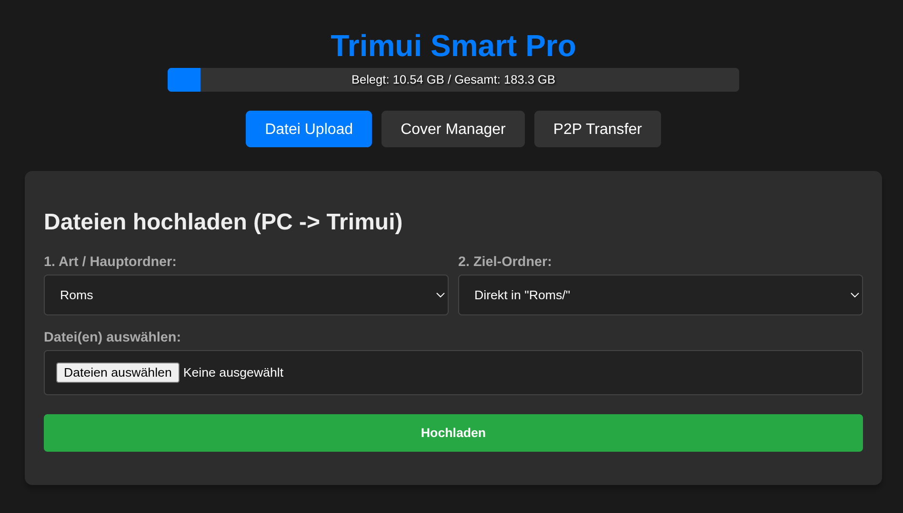
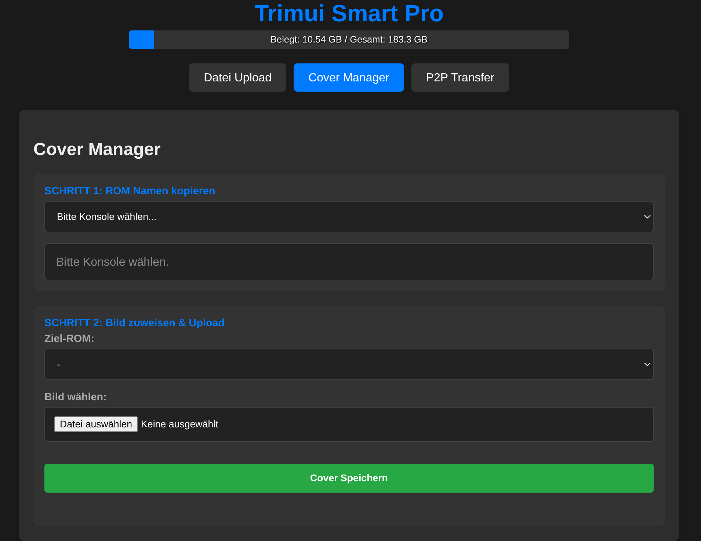
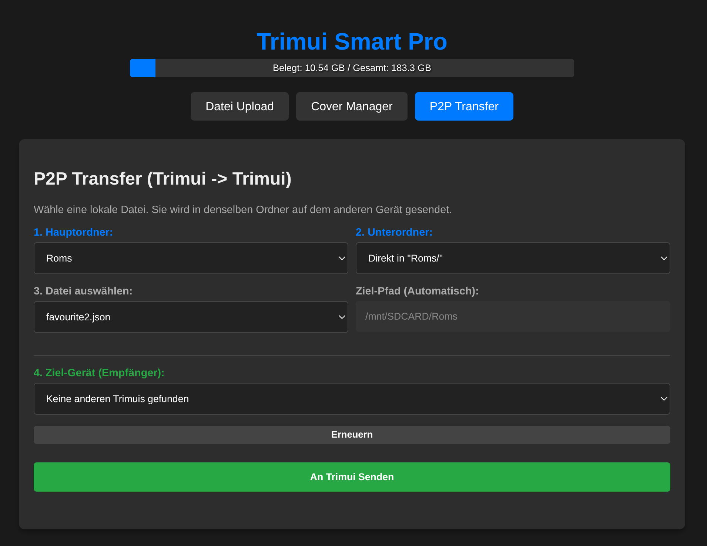

<div align="center">

# TrimUI Web Transfer

**A browser-based file manager for the TrimUI Smart Pro & Brick**

[](https://www.python.org/)
[](./web_transfer.py)
[](https://trimui.com)
[](#setup)
[](#)

*Runs directly on the handheld as a Python HTTP server.  
No installation on your PC needed — open a browser and go.*

</div>

---

## Screenshots

| File Upload | Cover Manager | P2P Transfer |
|:-----------:|:-------------:|:------------:|
|  |  |  |

---

## Features

| | Feature | Description |
|---|---------|-------------|
| ⬆️ | **File Upload** | Upload ROMs and files from your PC directly to the SD card |
| 🖼️ | **Cover Manager** | Browse ROMs by console, assign and upload thumbnail covers (600×800 PNG) |
| 🔁 | **P2P Transfer** | Send files directly between two TrimUI devices via ARP discovery — no PC needed |
| 💾 | **Storage Dashboard** | Live SD card usage bar with used / total display |
| 📂 | **Subfolder Navigation** | Dynamically browse the full folder structure before uploading |
| 🗂️ | **Multi-File Upload** | Select and upload multiple files at once |

---

## Setup

**1.** Copy all files to your TrimUI:
```
/mnt/SDCARD/Apps/ftp/
```

**2.** Launch the app — either run `launch.sh` directly or open it from the TrimUI app menu.

**3.** Find your TrimUI's IP address in the Wi-Fi settings, then open your browser:
```
http://<trimui-ip>:8000
```

---

## Directory Layout

| Path | Purpose |
|------|---------|
| `/mnt/SDCARD/Roms/` | ROM files, browsed and targeted in the Upload tab |
| `/mnt/SDCARD/Imgs/{console}/` | Cover art — one PNG per ROM, named after the ROM file |
| `/mnt/SDCARD/Apps/ftp/` | App installation directory |

---

## API Reference

| Method | Endpoint | Description |
|--------|----------|-------------|
| `GET` | `/api/roms` | ROM list grouped by console |
| `GET` | `/api/status` | SD card storage usage |
| `GET` | `/api/peers` | TrimUI devices discovered on the local network |
| `GET` | `/api/dirs?path=...` | Subdirectories of a given path |
| `GET` | `/api/files?path=...` | Files inside a directory |
| `GET` | `/api/cover?console=...&rom=...` | Cover image for a specific ROM |
| `POST` | `/post_upload` | File upload (multipart/form-data) |
| `POST` | `/api/transfer_start` | Initiate a P2P transfer to another device |

---

## Technical Details

- **Zero dependencies** — pure Python `http.server` + `ThreadingMixIn`, minimal footprint
- **No framework** — server-side template rendering with vanilla HTML / CSS / JS
- **P2P** — direct HTTP connection between devices, peers found via ARP cache scan
- **Security** — path traversal protection on all file operations, `os.path.basename()` on uploads
- **Dark theme UI** — responsive layout, works on any modern browser
